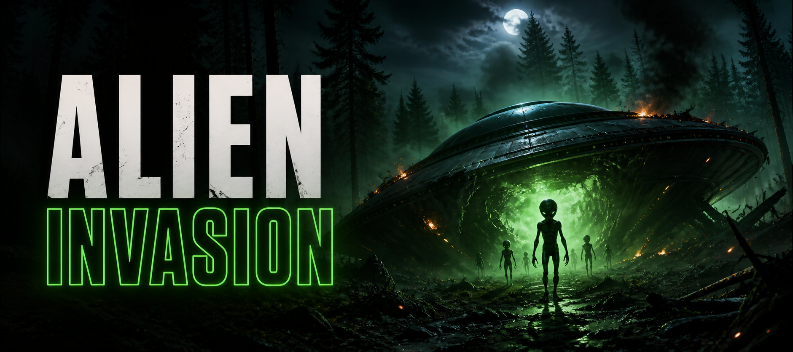

<h1 align="center">
  <br>
  <a href="https://steamcommunity.com/sharedfiles/filedetails/?id=2840597308"></a>
  <br>
  <a href="https://discord.gg/G8uSGZ8yyf"></a>
  <a href="https://steamcommunity.com/sharedfiles/filedetails/?id=2840597308"></a>
  <br>
</h1>

<h3 align="center">An Extraterrestrial Encounter Expansion for DayZ</h3>

<p align="center">
  
  
  <a href="https://steamcommunity.com/sharedfiles/filedetails/?id=2840597308"></a>
  <a href="https://packjc.github.io/alieninvasion/"></a>
</p>

<p align="center">
  <a href="https://packjc.github.io/alieninvasion/">Website</a> •
  <a href="#information">Information</a> •
  <a href="#key-features">Key Features</a> •
  <a href="#content">Content</a> •
  <a href="#server-setup">Server Setup</a> •
  <a href="#configuration">Configuration</a> •
  <a href="#classnames">Classnames</a> •
  <a href="CHANGELOG.md">Changelog</a> •
  <a href="#credits">Credits</a> •
  <a href="#license">License</a>
</p>

## Information

Alien Invasion brings a pulpy science-fiction encounter to DayZ. UFOs come down like helicopter crashes, wrapped in a toxic cloud, with alien technology in the wreckage and hostile little green men waiting for whoever comes to look. Survivors who make it through can recover experimental plasma weaponry and alien materials—and, naturally, protect themselves with a tin foil hat that actually works.

The mod includes custom models, textures, sounds, particles, localized item names, and Enforce Script behavior. It is designed for both the server and every connecting client.

## Key Features

- A custom UFO crash site with green light, fire, mist, wreck particles, distant crash audio, and an 18 m **toxic gas zone** (NBC gear protects).
- **Crash salvage:** a 35% chance of a Montauk Rifle with a cartridge, plus up to two spare cartridges.
- Hostile **Little Green Men** with their own voices and footsteps. Infected melee up close, a visible **psychic zap** from 4–80 m in line of sight, and a green burst and scream when they die.
- Aliens appear when a player comes within 300 m, so unvisited crash sites cost the server nothing.
- **Montauk Rifle**, a semi-automatic plasma weapon firing green bolts that deal double damage to aliens (other firearms deal 75%).
- **Montauk Cartridge**, a 15-round plasma magazine that can't be unloaded — recharge it with a 9V battery.
- **Tin Foil Hat:** aliens can't track the wearer beyond 3 m and can't zap them.
- **Area 51 Steak** and **Roswell Hide** from skinning aliens. Cooked steak gives 90 s of green night vision; bad meat gives food poisoning.
- **Roswell Hide crafting:** tan the hide into green **Roswell Leather**, then sew a **Roswell Leather Backpack**, or make a **Roswell Hide Courier Bag** and **Roswell Hide Backpack**.
- Every number is tunable in `$profile:Gebs/alieninvasion.json`, and the server generates its own economy files.
- Complete string-table support for English, Czech, German, Russian, Polish, Hungarian, Italian, Spanish, French, Traditional and Simplified Chinese, Japanese, and Portuguese.

## The Encounter

When a `geb_Aliencrash` object is created through DayZ's Central Economy (or with an admin tool on a dedicated server), it:

1. Plays the mod's distant UFO-crash sound (Central Economy spawns only).
2. Displays the wreck's custom fire, mist, glow, and particle effects for clients.
3. Surrounds itself with a toxic gas cloud and drops its salvage nearby.
4. Waits for a player to come within 300 m, then spawns 10–15 Little Green Men 5–25 m around the wreck.
5. When the event ends, removes its gas cloud and any surviving aliens along with the wreck.

The wreck is the encounter anchor; you never configure alien spawns separately.

## Content

### Little Green Man

The alien is based on DayZ's infected behavior and uses its own model, voice, and footsteps. Up close it fights like an infected; when it's chasing you in the open it zaps you from range. It can be skinned with any knife or cutting tool, producing two Area 51 Steaks, a Roswell Hide, and vanilla gutting materials.

### Montauk Rifle

The plasma rifle is a semi-automatic firearm built on the Ruger 10/22 weapon base (config and script both). It uses the dedicated Montauk Cartridge and fires green plasma bolts that hit aliens twice as hard as ordinary bullets.

### Montauk Cartridge

A sealed 15-round plasma magazine. It can't be unloaded; combine it with a 9V battery to recharge it. A full battery fills a full cartridge.

### Alien Materials

- **Area 51 Steak** inherits DayZ's meat preparation and cooking states. Eaten cooked (baked, boiled, or dried) it gives 90 seconds of green night vision; raw, burnt, or rotten it gives food poisoning.
- **Roswell Hide** is the alien's harvestable pelt. It is green at every step of vanilla's leather chain:
  - Hide + garden lime (by hand or in a barrel) → **Roswell Leather**, up to 12 per hide.
  - 2 Roswell Leather + leather sewing kit → **Roswell Leather Backpack** (6×7 cargo).
  - Hide + rope → **Roswell Hide Courier Bag** (5×6); + 3 wooden sticks → **Roswell Hide Backpack** (7×5).
  - Each bag breaks back down with a knife or blade, like vanilla's.

### Tin Foil Hat

A lightweight hat that really does keep the aliens out of your head: they can't track an intact foil hat's wearer beyond 3 m, so they can't zap them either.

## Requirements

- DayZ
- The mod must be loaded on both the server and client.
- No third-party mod is declared as a runtime dependency.
- **[Subscribe on the Steam Workshop](https://steamcommunity.com/sharedfiles/filedetails/?id=2840597308)** to receive the published mod and updates.

## Server Setup

1. Install the mod folder and key on the server, and add it to the server and client launch parameters.
2. Start the server once. The mod writes `alieninvasion.json` and six economy files into `$profile:Gebs/` (next to Gebsfish's, if you run it):
   ```text
   <profile>/Gebs/
   |-- alieninvasion.json
   `-- mpmissions/
       |-- alieninvasion-types.xml
       |-- alieninvasion-spawnabletypes.xml
       |-- alieninvasion-events.xml
       |-- alieninvasion-cfgeconomycore.xml
       |-- alieninvasion-cfgeventspawns.xml
       `-- alieninvasion-mapgroupproto.xml
   ```
3. Copy the types, spawnable types, and events files into `mpmissions/<mission>/alieninvasion/` and paste the `<ce folder="alieninvasion">` block into the mission's `cfgeconomycore.xml`.
4. Merge the `StaticAlienCrash` positions into `cfgeventspawns.xml` (79 hand-picked sites on Chernarus; other maps reuse their heli-crash positions) and the wreck's loot group into `mapgroupproto.xml`.
5. Restart. Don't add the old `InfectedAlien` secondary event — each wreck spawns its own aliens.

The generated files are only rewritten when the mod version changes, and the mod never edits your mission folder itself. Step-by-step instructions with copy buttons are on the [website](https://packjc.github.io/alieninvasion/#install); a plain-text version is in [`docs/server-guide.txt`](docs/server-guide.txt).

## Configuration

`$profile:Gebs/alieninvasion.json` holds every tunable, all server-side:

| Setting | Default | What it does |
| --- | --- | --- |
| `CrashAliensMin` / `CrashAliensMax` | 10 / 15 | Aliens per wreck |
| `CrashAliensSpawnDistance` | 300 | Metres a player must come within before aliens appear (0 = immediately) |
| `CrashRifleChance` | 0.35 | Chance of a Montauk Rifle in the wreckage |
| `CrashSpareCartridgesMax` | 2 | Spare cartridges per wreck |
| `CrashGasZone` | true | Toxic cloud around each wreck |
| `PsychicZapEnabled` | true | Aliens zap their target at range |
| `PsychicZapMinRange` / `PsychicZapRange` | 4 / 80 | Zap distance band in metres (needs line of sight) |
| `PsychicZapCooldown` | 60 | Seconds between zaps per alien |
| `PlasmaDamageVsAliens` | 2.0 | Plasma damage multiplier against aliens |
| `OtherFirearmDamageVsAliens` | 0.75 | Other firearms' damage multiplier against aliens |
| `FoilHatDetectRange` | 3 | Aliens can't target a foil hat's wearer beyond this |
| `AlienVisionSeconds` | 90 | Night vision from cooked alien meat |
| `BadMeatPoison` | 100 | Food-poisoning agents per bite of bad meat |

A file that fails to parse is never overwritten; the server logs the error and runs on defaults.

## Classnames

| Classname | Type | Description |
| --- | --- | --- |
| `geb_Aliencrash` | Encounter object | UFO wreck with effects, audio, gas, salvage, and alien spawning |
| `StaticObj_geb_Aliencrash` | Static object | Visual UFO wreck without the scripted encounter behavior |
| `geb_AlienRadiationArea` | Effect area | The wreck's toxic cloud (created and removed by the wreck) |
| `geb_GreenAlien` | Creature | Hostile Little Green Man |
| `geb_GreenAlienMeat` | Food | Area 51 Steak harvested from an alien |
| `geb_GreenAlienSkin` | Material | Roswell Hide harvested from an alien |
| `geb_GreenAlienLeather` | Material | Roswell Leather, tanned from the hide |
| `geb_GreenAlienLeatherSack` | Backpack | Roswell Leather Backpack |
| `geb_GreenAlienCourierBag` | Backpack | Roswell Hide Courier Bag |
| `geb_GreenAlienImprovisedBag` | Backpack | Roswell Hide Backpack |
| `geb_PlasmaRifle` | Weapon | Semi-automatic Montauk Rifle |
| `geb_PlasmaCartridge` | Magazine | 15-round Montauk Cartridge (rechargeable) |
| `geb_FoilHat` | Clothing | Tin Foil Hat |

## Project Structure

```text
alieninvasion/
|-- config.cpp          # Mod registration and script-module definitions
|-- data/               # Entity configs, models, textures, and sounds
|-- docs/               # GitHub Pages site and plain-text server guide
|-- graphics/particles/ # Plasma and UFO particle effects
|-- languagecore/       # Localized display names and descriptions
`-- scripts/
    |-- 3_game/         # Version, server config, file generator, alien-vision tint
    |-- 4_world/        # Wreck, aliens, gas zone, rifle, items, recipe, player hooks
    `-- 5_mission/      # Server startup: loads the config, writes the Gebs files
```

## Credits

- Geb — creator and author
- The DayZ Modding Community

Contributions and bug reports are welcome through this repository's issues and pull requests.

## License

Alien Invasion is distributed under the [GNU General Public License v3.0](https://www.gnu.org/licenses/gpl-3.0.html). You may use, study, modify, and redistribute the source under the terms of that license.

DayZ and Bohemia Interactive are trademarks or registered trademarks of Bohemia Interactive. This community project is not affiliated with or endorsed by Bohemia Interactive.
